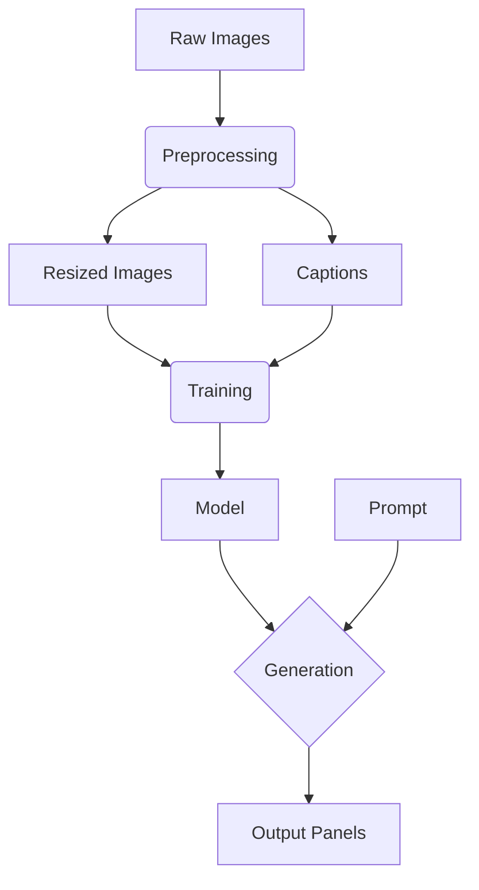

```markdown
# 🎨 Manga Generation Pipeline

[](https://www.python.org/downloads/)
[](https://opensource.org/licenses/MIT)
[](https://pytorch.org/)

Text-conditioned manga panel generation system using deep learning. Automatically processes chapters, trains generation models, and creates new content from prompts.

## 🚀 Quick Start

```bash
# 1. Preprocess data
python main.py preprocess

# 2. Train model
python main.py train

# 3. Generate panels
python main.py infer --prompt "A samurai standing in neon-lit rain"
```

## 📦 Installation

```bash
git clone https://github.com/yourusername/manga-generation-pipeline.git
cd manga-generation-pipeline
pip install -r requirements.txt
```

**System Requirements**:
- Python 3.8+
- NVIDIA GPU (recommended)
- CUDA 11.3+
- 10GB+ disk space for models

## 🖥️ Usage

### 📂 Data Preparation
```bash
python main.py preprocess
```
Organizes chapter structure:
```
data/
├── raw/
│   └── chapter_1/
│       ├── page_01.png
│       └── page_02.png
└── processed/
    └── chapter_1/
        ├── captions.txt
        └── resized/
```

### 🧠 Model Training
```bash
python main.py train
```
Key training parameters (adjust in `config.py`):
```python
BATCH_SIZE = 32
TRAINING_EPOCHS = 100
LEARNING_RATE = 0.001
```

### 🎨 Generation
<details>
<summary>📌 Example Prompts</summary>

```bash
# Action scenes
python main.py infer --prompt "Explosive mecha battle in ruined city"

# Atmosphere
python main.py infer --prompt "Lonely figure in foggy graveyard at dusk"

# Character focus
python main.py infer --prompt "Close-up of cyborg's glowing red eye"
```
</details>

## ⚙️ Configuration
Edit `config.py` for:

| Parameter | Description | Default |
|-----------|-------------|---------|
| `TARGET_IMAGE_SIZE` | Output resolution | `(512, 512)` |
| `CONDITION_DIM` | Text encoding size | `768` |
| `MAX_PNGS_PER_BATCH` | VRAM management | `32` |

## 📚 Documentation

### Pipeline Architecture


## 💡 Notes
- First run downloads BLIP (∼1.5GB) and sentence-transformers (∼420MB)
- Add `--num_panels` flag to control output quantity
- Generation time: ~2s/panel on RTX 3090

## 🤝 Contributing
PRs welcome! Please follow:
1. Fork the repository
2. Create your feature branch
3. Commit changes
4. Push to the branch
5. Open a PR
